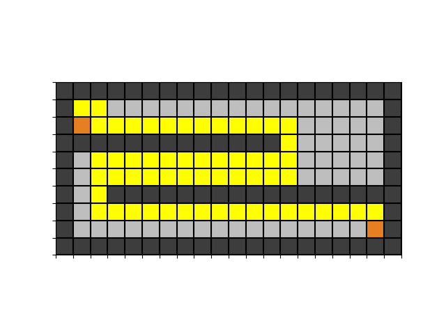

# CPEN513 A1 Routing

## Run the program

run the animation.py

```
cd routing
python animation
```

inside the file, you can specify the benchmark file and also the routing function.

1. benchmark file 

   put filename as the first argument or specify it inside the file

   ```
   line 17: filename = "temp"
   ```

   

2. routing function

   `frame = $routing function$`

   ```
   line 181:
   	ani = animation.FuncAnimation(fig, update_anim,
       init_func=init_anim, frames=route_with_shuffle(10),
       repeat=False, interval=100, save_count=200)
   ```

   

## Test

`Pytest` is used here


run the `route_test.py` file with `pytest` under the routing directory

```
cd routing
python -m pytest route_test.py
```

## Gif results

1. example
   
   

2. impossible
   
   

   

3. impossible2
   
   

   

4. kuma
   
   

5. misty
   
   

6. oswald
   
   

7. rusty

   
   

8. stanley

   
   

9. stdcell

   
   

10. sydney
    
    

11. temp
    
    

12. wavy
    
    