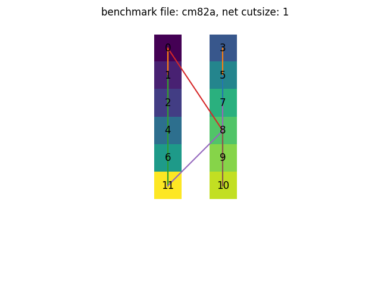
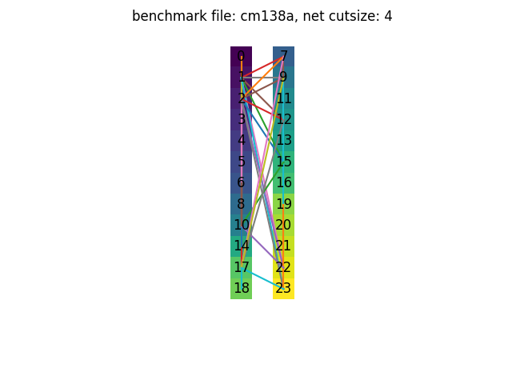
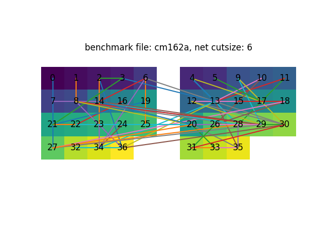
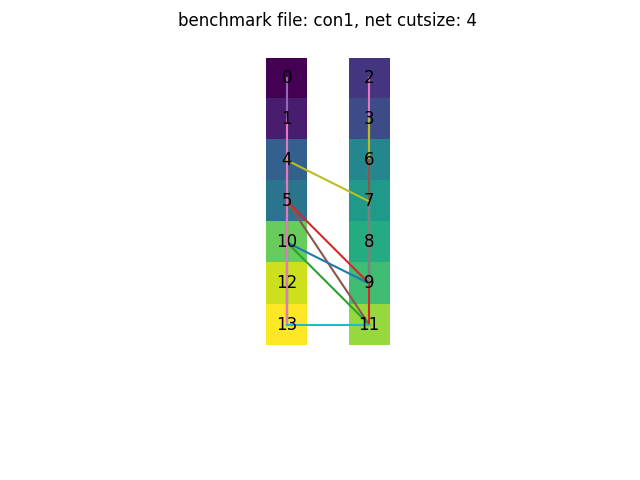
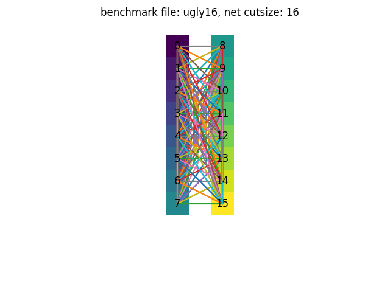
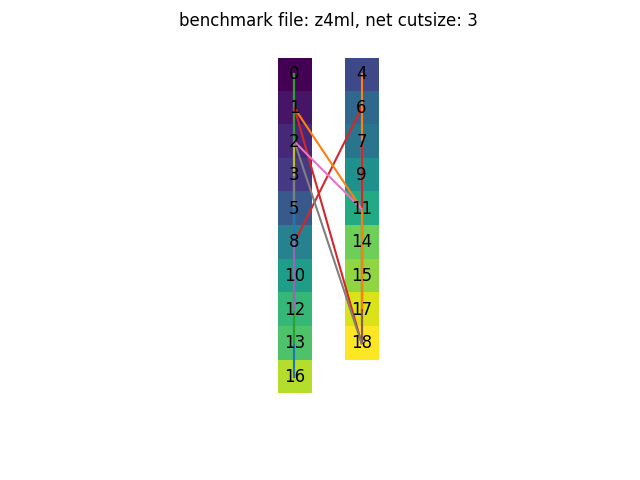

# A3 Branch and Bound Partitioning

## Summary

In this assignment, Branch and Bound Partitioning as well as Kernighan-Lin algorithm are implemented to do bi-partitioning. We optimize partitioning to minimizing the number of nets crosses partition. We also optimize partitioning to minimizing the number of edges crosses partition. Both of the results are presented in the `Results` part.

([GitHub repository](https://github.com/TAN-ZIXUAN/CPEN513/tree/main/partitioning))

## Algorithm

### Branch and Bound Algorithm

Branch and bound algorithm guarantees us the optimal result. We set the initial best cutsize to be a big and impossible value, which is the total number of nets plus one.

Here is the main code which implements the branch and bound partition algorithm in a recursive way.

```python
def recursive_bb_partition(curr_assignment, node_to_assign, min_cutsize): 
    """Branch and Bound partition (recursivw)
    Args:
        curr_assignment: assignment array eg. [[node1, node2,..],[node3, node4,...]]
        node_to_assignment: a number represent the node to assign
        min_cutsize: minimum cutsize so far
    """
    global best_assignment, best_cutsize
    
    if node_to_assign == None:
        curr_cutsize = cal_net_cutsize(curr_assignment)
        if curr_cutsize < best_cutsize:
            best_cutsize = curr_cutsize
            best_assignment = curr_assignment
        print("best assignment: {}, current min_cutsize: {}".format(best_assignment, min_cutsize))

    else:
        tmp_cutsize = cal_net_cutsize(curr_assignment)
        if tmp_cutsize < min_cutsize:
            next_node = select_next_node(node_to_assign)
            # check left branch
            if check_partition(curr_assignment, 0):
                next_node = select_next_node(node_to_assign)
                tmp_assignment = [curr_assignment[0] + [node_to_assign], curr_assignment[1]] 
                if (cal_net_cutsize(tmp_assignment) < best_cutsize):
                    recursive_bb_partition(tmp_assignment, next_node, best_cutsize)

            # check right branch
            if check_partition(curr_assignment, 1):
                next_node = select_next_node(node_to_assign)
                tmp_assignment = [curr_assignment[0], curr_assignment[1] + [node_to_assign]] 
                if (cal_net_cutsize(tmp_assignment) < best_cutsize):
                    recursive_bb_partition(tmp_assignment, next_node, best_cutsize)
```

As this algorithm has exponential time complexity, it takes a very long time to partition large benchmark files such as “twocm”. We also implement the Kernighan-Lin /  Fiduccia-Matheyses for fast partition.

### Kernighan-Lin /  Fiduccia-Matheyses

Kernighan-Lin algorithm is implemented to do bi-partitioning.  It is implemented for fast partitioning for benchmark files `twocm`, `cc`

We use max heap queue to stores the unlocked nodes so that we can get or pop the nodes with the  highest gain. 

```python
function partition(num_passes):
    initial gains of nodes
    get current cutsize, partition, edges
    min_edge_cutsize = current edge_cutsize
    for _ in range(num_passes):
        unlock all nodes
        while chip has unlocked nodes:
        	calculate all gains
            node = select_node()
            move_node(node)
            cutsize -= node.gain
            if cutsize < min_cutsize:
                update min_cutsize
                store current partition
                store edges
        rollback_to_saved_partition(partition_copy, edges_copy)        
```

When selecting node, we select nodes whose move would not cause an imbalance. In every iteration, we store the partition with min edge cutsize

When moving nodes, we also update gains of all the nodes that connects to the our selected node.

### Net cut size

We also calculated the net cut size. The net cut size stores the number of net which crosses partition.

### Node gain

1. minimizing net cutsize

   For every net that the node connect to, we increase gain if the node is the only node which makes the net crosses partition. We decrease gain if the all of the nodes in the net is in the same block.

2. minimizing edge cutsize

   We traverse the edges that the node connects to. We increase gain if the edge crosses partition and decrease gain if the edge does not crosses partition


## Test

A test file is created for testing the function which calculates the edge cutsize. We load the benchmark file `cm82a.txt`. `block0` and `block1` is created to store the bi-partition results. Nodes with even id are assigned to `block0` and nodes with odd id are assigned to `block1`.

```python
expected_result = 0
# all nodes with even id in block0 and all nodes with odd id in block1
for node_id in chip.graph_id:
    for nei_id in chip.graph_id[node_id]:
        if nei_id % 2 != node_id % 2:
            expected_result += 1

print("expected", expected_result)
def test_calc_edge_cutsize():
    assert chip.calc_cutsize() == expected_result
```

Test is passed.

`1 passed in 0.45s`

## GUI

We use  `matplotlib` to plot the final partition result

## Results

minimize the nets crosses partition

| benchmark files | net cutsize |
| --------------- | ------------ |
| cc              | 8          |
| cm82a           | 1           |
| cm138a          | 4          |
| cm150a          | 6          |
| cm162a          | 6         |
| con1            | 4           |
| twocm           | 12           |
| ugly8           | 8          |
| ugly16          | 16         |
| z4ml            | 3          |

1. `cc`

2. `cm82a`

   

3. `cm138a`

   

4. `cm150a`

5. `cm162a`

   
   
6. `con1`

   

7. `twocm`

8. `ugly8`

   

9. `ugly16`

   

10. `z4ml`

    