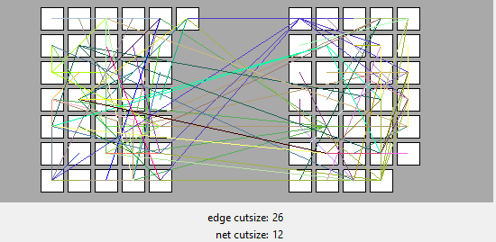
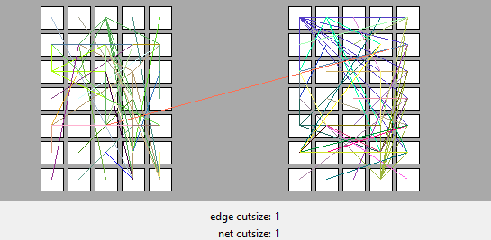

# A3 Branch and Bound Partitioning

## Summary

In this assignment, Kernighan-Lin algorithm is implemented to do bi-partitioning. We optimize partitioning to minimizing the number of nets crosses partition. We also optimize partitioning to minimizing the number of edges crosses partition. Both of the results are presented in the `Results` part.

(GitHub repository)

## Algorithm
### Kernighan-Lin /  Fiduccia-Matheyses

Kernighan-Lin algorithm is implemented to do bi-partitioning. 

We use max heap queue to stores the unlocked nodes so that we can get or pop the nodes with the  highest gain. 

```python
function partition(num_passes):
    initial gains of nodes
    get current cutsize, partition, edges
    min_edge_cutsize = current edge_cutsize
    for _ in range(num_passes):
        unlock all nodes
        while chip has unlocked nodes:
        	calculate all gains
            node = select_node()
            move_node(node)
            cutsize -= node.gain
            if cutsize < min_cutsize:
                update min_cutsize
                store current partition
                store edges
        rollback_to_saved_partition(partition_copy, edges_copy)        
```

When selecting node, we select nodes whose move would not cause an imbalance. In every iteration, we store the partition with min edge cutsize

When moving nodes, we also update gains of all the nodes that connects to the our selected node.

### Graph

We create a graph to store nodes and their connections. The graph is presented by a python dictionary, where the key is the node and value is a set which contains all the nodes it directly connecting to.

```
graph = {node0: (node1, node2),
		node1:(node0, node3),
		node2:(node1),
		...}
```

### Edges  and Edge cut size

We use python dictionary to store all the edges. 

Key is a `frozenset` which contains the two vertices(nodes) of the edge. Value is the status of the edge (whether it’s cut). True represents `is cut` and False represents `not cut`. This is used to calculate the edge cut size of the bi-partitioning. Edge cut size stands for the number of edge that crosses partitioning.

### Net cut size

We also calculated the net cut size. The net cut size stores the number of net which crosses partition.

### Node gain

1. minimizing net cutsize

   For every net that the node connect to, we increase gain if the node is the only node which makes the net crosses partition. We decrease gain if the all of the nodes in the net is in the same block.

2. minimizing edge cutsize

   We traverse the edges that the node connects to. We increase gain if the edge crosses partition and decrease gain if the edge does not crosses partition


## Test

A test file is created for testing the function which calculates the edge cutsize. We load the benchmark file `cm82a.txt`. `block0` and `block1` is created to store the bi-partition results. Nodes with even id are assigned to `block0` and nodes with odd id are assigned to `block1`.

```python
expected_result = 0
# all nodes with even id in block0 and all nodes with odd id in block1
for node_id in chip.graph_id:
    for nei_id in chip.graph_id[node_id]:
        if nei_id % 2 != node_id % 2:
            expected_result += 1

print("expected", expected_result)
def test_calc_edge_cutsize():
    assert chip.calc_cutsize() == expected_result
```

Test is passed.

`1 passed in 0.45s`

## GUI

We use `tkinker` to select benchmark files and represent final partition result.

## Results

1. minimize the nets crosses partition
| benchmark files | net cutsize | edge cutsize |
| --------------- | ------------ | ----------- |
| cc              | 8          | 23        |
| cm82a           | 1           | 2          |
| cm138a          | 4          | 11         |
| cm150a          | 6          | 14         |
| cm162a          | 8          | 15        |
| con1            | 4           | 6          |
| twocm           | 12           | 26         |
| ugly8           | 8          | 15         |
| ugly16          | 16         | 64        |
| z4ml            | 4           | 6          |


1. minimize the edges crosses partition

| benchmark files | edge cutsize | net cutsize |
| --------------- | ------------ | ----------- |
| cc              | 18           | 10          |
| cm82a           | 2            | 1           |
| cm138a          | 15           | 9           |
| cm150a          | 11           | 7           |
| cm162a          | 15           | 10          |
| con1            | 6            | 4           |
| twocm           | 1            | 1           |
| ugly8           | 15           | 8           |
| ugly16          | 63           | 16          |
| z4ml            | 6            | 5           |

We discovered something interesting, The differences for results of `twocm` are huge. When our goal is to minimize edge cutsize, the edge cutsize and net cutsize are optimized to 1. However when our goal is to minimize net cutsize, the optimal net cutsize we get is 12.



