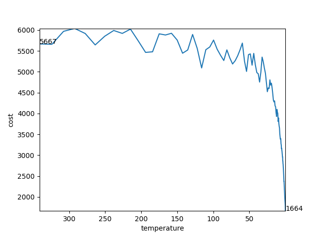

# CPEN513 A2 Placement

## Run the programme

under the folder `placement`

`python placing`

## Test

under the folder `placement`

`python -m pytest half_perimeter_test.py`

### GUI

`FuncAnimation` from `matplot` is easy to implement when draw direct data grid or chart. This time we need to draw nets connections.  Drawing random shapes or lines are easier on GUI tools like `tkinker`. So both`matplot` and `tkinker` are used in this program.  `tkinker` shows the real time chip placement and `matplot` is used to draw the line chart of cost and temperature after annealing.

## Results

| benchmark file | initial cost | final cost | improvements |
| :------------: | ------------ | ---------- | ------------ |
|      alu2      | 5667         | 1664       | 71%          |
|     apex1      | 33587        | 12000      | 64%          |
|     apex4      | 69314        | 23798      | 66%          |
|      c880      | 5781         | 1989       | 66%          |
|     cm138a     | 139          | 57         | 59%          |
|     cm150a     | 235          | 105        | 55%          |
|     cm151a     | 208          | 51         | 75%          |
|     cm162a     | 363          | 121        | 67%          |
|      cps       | 35769        | 11251      | 69%          |
|      e64       | 11284        | 4134       | 63%          |
|     paira      | 41435        | 11452      | 72%          |
|     pairb      | 72997        | 15397      | 79%          |

(*`improvements = -(final_cost - initial_cost) / initial_cost *100%`)

### animation

- alu2

  

  <video src="C:/Users/Tan/Videos/Captures/Placement 2021-03-04 21-37-18.mp4"></video>

  

- 