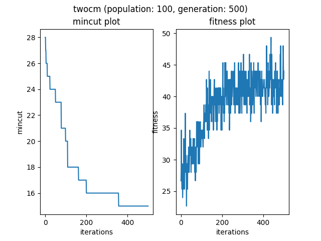

# Genetic Algorithm for Bi-Partitioning

## Summary

In this project, genetic algorithm is implemented on bi-partitioning to achieve the minimum net cutsize. I tested the genetic bi-partitioning algorithm on various benchmark files. Genetic algorithm is able to generate optimal solutions very fast with small population for most of the benchmark files. Bigger population and generations are needed for larger benchmark files in order to compute a good partitioning.

[(GitHub repository)](https://github.com/TAN-ZIXUAN/CPEN513/tree/project/project)

## Algorithms

### Genetic Algorithm

Genetic algorithm simulates the process of the natural selection.  There is a population in the genetic algorithm. Population consists of many chromosomes. Each chromosome represent a solution for our problem. So population is a set of solutions. What genetic algorithm does is to generate the optimal solution after many generations. 

During each generation, we select individuals from the population and mate them. Individuals with higher fitness are more likely to be selected. Also, there exists mutation as well. Some are randomly selected to have mutations on their chromosome. This gives us some exploration on more other possible solutions. 

We need also check if the solution is balanced or not. If not, we need to flip the 1s and 0s to have the solution balanced. For each generation, the two chromosomes with the best fitness becomes part of the new generation, others are the offsprings from mating.

We also set the exit criterion to allow the algorithm stops early before reaching the generation limit.

#### 1 chromosome

For this bi-partitioning problem, chromosome is a list of 0 and 1 and the index of list represents the node id. The value 0 and 1 stands for the two partitions (0 and 1).  For example, *0011* means node 0 and 1 is in partition 0 while node 2 and 3 are in partition 1. 

The length of chromosome is the same as the node number of the benchmark file. So each chromosome represents a possible partition for the given benchmark file.

#### 2 population

Population is a set of chromosomes. So a population contains a set of partition solutions for the given benchmark file. 

#### 3 mating

During each generation, two chromosomes will be selected to mate and generate two offsprings, which is also called crossover. The priority is based on their fitness.

#### 4 crossover

We do single-point crossover here. A random position  of the chromosome is selected. We cut the two chromosomes into half at the selected the position and swap their chromosome fragments. 

Since `0011` and `1100` both stands for the same partition. And their crossover result(offsprings) would still be  the same partition.  Complement is used there to prevent this. Suppose two chromosomes a an b are selected to mate. With the crossover point, a is cut to (a1, a2) while b is cut to (b1, b2). The first offspring is still common combinations (a1, b2). But for the second offspring, we use the the complement of b2(represented by *-b2*). So the second offspring is (a1, -b2).

#### 5 mutation

Mutation is just randomly flip the value, 0 to 1 or 1 to 0. Some chromosome are randomly chosen to have mutations with a given mutation probability.

#### 6 balance the partition.

We are using genetic algorithm to do bi-partitioning, which requires the partition to be balanced. The number of nodes in two partitions should be the same or with at most one difference. The genetic algorithm might give us unbalanced solution if we do not take care of the balancing problem. It may also automatically put all nodes into just one side of the partition to have the best net cutsize 0.

So every time we check if the solution represented by the chromosome is a balanced solution. If it is not balanced, we randomly flip some 0 to 1 and 1 to 0 to balance the chromosome. This is also some kind of mutation.

#### 7 fitness

Based on the paper [1], the fitness function is:

$F_i = (C_w - C_i) + (C_w - C_b) / 3$

where

- $C_w$: cutsize of the worst solution in the population
- $C_b$: cutsize of the best solution in the population
- $C_i$ cutsize of the solution $i$

#### 8 exit criterion

I tried several exit criterion but none of them works pretty well. There is a “hard” exit criterion, which checks if the cutsize reaches a preset value.  I set it to 0.

Another exit criteria is based on the paper [1]. When most (80%) of the chromosomes’ fitness are the same, we exit the algorithm.  Actually, it never works. The programme never exits early after many generations even with rounded fitness value.

The final one is calculating the standard deviation of fitness. But it does not work well. The standard deviation values is different for different benchmark files. It is hard to have a standard deviation value limit that works for most of the benchmark files.

However, the exit criterion work extremely well for benchmark files like `ugly8` and `ugly16`. The optimal result is given instantly.

### Main Code

```python
def ga(
    population_size,
    populate_func,
    fitness_func,
    selection_func,
    crossover_func,
    mutation_func,
    exit_criterion_func,
    cutsize_limit,
    generation_limit=100):
    """ genetic algorithm
    
    run evolution and return the final population after evolution
    
    Args:
        population_size: size of population
        pupulated_func: function for generating population
        unfitness_func: function for calculating unfitness(cutsize)
        cutsize_limit: the limit of cutsize. we exit evolution if we reach the limit(best cutsize <= unfitness_limit)
        crossover_func: function for crossover between two chromosome
        selection_func: function for selecting a pair of mates from population
        mutation_func: function for mutation
        exit_criterion_func: function for exit criterion
        cutsize_limit: cutsize limit used in exit criterion function
        generation_limit: the number of generation we want to go through
    Returns:
        final population after evolution
    """
    population = populate_func(size=population_size, chromosome_length=num_nodes)
    global mincuts, fitnesses # for plotting
    # empty lists first
    mincuts = []
    fitnesses = []

    for i in range(generation_limit):
        
        # sort population. fitness from high to low
        population = sorted(population, key= lambda chromosome : calc_fitness(chromosome, population), reverse=True)
        best_fitness = calc_fitness(population[0], population)
        population_mincut = sorted(population, key=calc_chromo_cutsize)
        best_cutsize = calc_chromo_cutsize(population_mincut[0])
        fitnesses.append(best_fitness)
        mincuts.append(best_cutsize)

        print("generation:{}, fit:{}, cutsize:{}".format(i, best_fitness, best_cutsize))

        # stop looping if  we meet the exit criterion
        if exit_criterion_func(population, cutsize_limit):
            break
        
        # pick the best two from population as the part of the next generation
        next_generation = population[0:2]
        # next_generation = [population[0]]

        for _ in range(len(population) // 2 - 1):
            # pick two to do crossover and mutation to generate next generation
            parents = selection_func(population, fitness_func)
            # crossover
            offspring_a, offspring_b = crossover_func(*parents)
            # mutation
            offspring_a = mutation_func(offspring_a)
            offspring_b = mutation_func(offspring_b)
            if not is_balanced(offspring_a): adjust(offspring_a)
            if not is_balanced(offspring_b): adjust(offspring_b)
            next_generation.extend([offspring_a, offspring_b])
        
        # update population
        population = next_generation
    
    # return the final population after evolving
    # final sort
    population = sorted(population, key= lambda chromosome : calc_fitness(chromosome, population), reverse=True)
    best_fitness = calc_fitness(population[0], population)
    population_mincut = sorted(population, key=calc_chromo_cutsize)
    best_cutsize = calc_chromo_cutsize(population_mincut[0])
    # for visualization and line chart
    fitnesses.append(best_fitness)
    mincuts.append(best_cutsize)
    return population
```


## Results and Conclusions

Smaller population works very well and fast for most of the benchmark files. But for bigger benchmark files, genetic algorithm with small population is easily get stuck at a local optimal even if we let it run for many more generation. It needs bigger population and many generations for large benchmark files like `cc` and `twocm`. Also it does not guarantees us a optimal results. I run the genetic algorithm on `cc` and `twocm` for days with very large population and generations and it still fails to give me the results. For `cc` it can only reduce the net cutsize to 6 instead of the optimal net cutsize 4. For `twocm`, it can only reduce the cutsize to around 10 instead of 1. My computer cannot support the algorithm running with more population and generations. So I could not get the optimal results for `cc` and `twocm`. I would not know if the algorithm is just stuck at a local optimal temporarily and will get to the optimal results eventually if running with longer generations.




But the algorithm and exit criterion work extremely well for benchmark files like `ugly8` and `ugly16` even with very small population and limited generations. The optimal result is given immediately.


In conclusion, genetic algorithm works better and faster on smaller benchmark files as only small population and a few generations are needed. As the size of the benchmark file growing, bigger population and more generations are needed. Hence, the running runtime of genetic algorithm will also be growing and even slower than branch and bound algorithm whose time complexity is exponential. Also it does not guarantees the optimal results. But the algorithm performs extremely well on benchmark files like `ugly8` and `ugly16` as it generates the optimal partition results instantly. 

Below is a table that shows the net cutsize achieved by genetic algorithm versus the actual optimal cutsize the benchmark file should have.

| benchmark files | cutsize/optimal cutsize |
| --------------- | ----------------------- |
| **cc**          | **6/4**                 |
| cm82a           | 1/1                     |
| cm138a          | 4/4                     |
| cm150a          | 6/6                     |
| cm162a          | 6/6                     |
| con1            | 4/4                     |
| **twocm**       | **11/1**                |
| ugly8           | 8/8                     |
| ugly16          | 16/16                   |
| z4ml            | 3/3                     |

## References

[1]: Bui, Thang Nguyen, and Byung Ro Moon. "Genetic algorithm and graph partitioning." *IEEE Transactions on computers* 45.7 (1996): 841-855.

## Appendix - visualizations and line charts

### 1 cc


### 2 cm82a


### 3 cm138a


### 4 cm150a


### 5 cm162a


### 6 con1


### 7 twocm


### 8 ugly8


### 9 ugly16


### 10 z4ml


