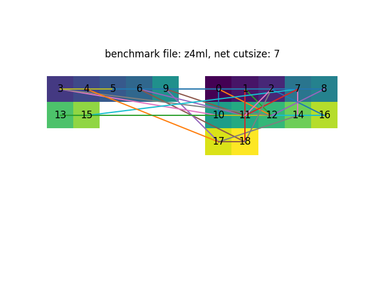
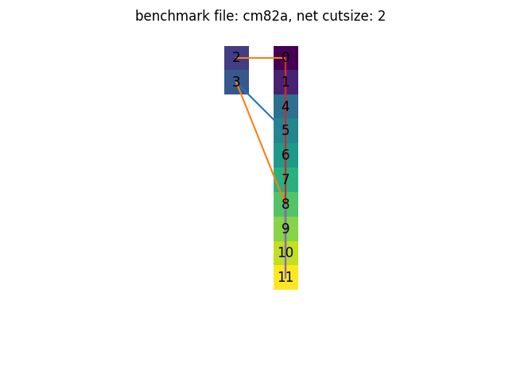
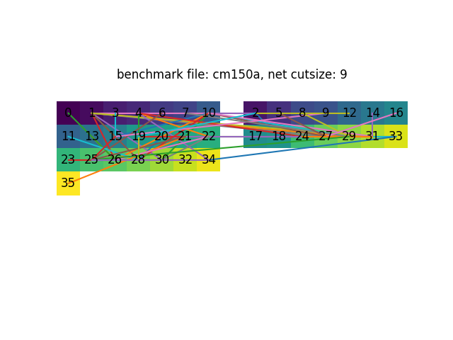

1. implement the genetic algorithm . using just cutsize to calculate fitness

   the programme just group all nets to one side of the partition hence the partition is of cause optimal(the cutsize is 0!)

2. using fitness function from the paper. it solves the above problem but often the partition result is not very balanced.

   but the partition result is very unbalanced and the cutsize is often not great even for small benchmarch files

   

3 it give me great result when I make the population size larger(10 -> 100), and generation time is 100. but it is really slow. it took a long time for small benchmark file like `cm82a`

4 runtime does not have many different between different amount of nodes. but it does take a long time to evolve.

## crossover

there are two types of crossover. we execute each type of them to generate offspring 1 and 2

a[a1:a2] b[b1:b2]

1. normal crossover 

   offspring1 = [a1:b2]

2. second crossover

   offspring2 = [a1: negate(b2)]

we only do single point crossover as study found that multipoint crossover degrades the performance

## mutation

just normal approach

probability could be set to a lower value

## check if it’s balanced

left side and right side must be balanced

so num of 1 and num of 0 should be the same or at most 1 difference

### generate the chromosome

I think we need to generate balanced chromosome at first

### adjustment after crossover and mutation

after crossover and mutation, the chromosome might be unbalanced. so  we randomly select some points of genes and flip them to meet the required the number of 0s and 1s.

the adjustment itself is some kind of mutation.

## local improvement

todo

## Replacement Scheme

### loose replacement scheme

replace the worst member of the  population with the new offspring => converge  quickly at the expense of loosing diversity’ in the population

### strict replacement scheme

can maintain a high diversity for a long time and consequently can get good solutions at the expense of time

### replacement scheme in the paper

## stopping criterion

> The stopping criterion that GBA used  is to stop when 80% of the population is occupied by solutions with the same quality, whose chromosomes are not  necessarily the same. In any case, no more than 3,000 iterations are allowed. Typical numbers of iterations are from  150 to 900.

## pre-processing

haven’t figure out this part yet

## notes

experiment with different hyperparameters population size, iteration times,

draw the best cutsize of each generation 折线图

mincut plot and fitness plot similar to [paper](http://www.ijcee.org/papers/136.pdf)

pick some benchmark files to create stacked plot like this?

I am going to just plot for each benchmark file right now

and also change the mutation prob like table 4.2 in this paper

I found that small population with large generation works faster and better

but small population often stuck at a local optimal value and can hardly go down (cc 10 200 vs 20 200)

stdev does not work well as a exit criteria
but counting fitness works extremely well for ugly 8 and 16. the results are generated immediately
small population works for most of the benchmark files. But for some large benchmark files, it is easily to get stuck in a local minimum with just small population

for files like cc and twocm, it won't work even with a population of 100