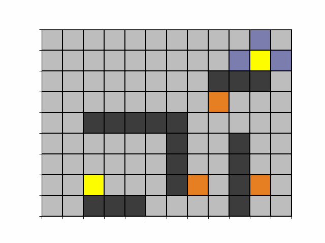
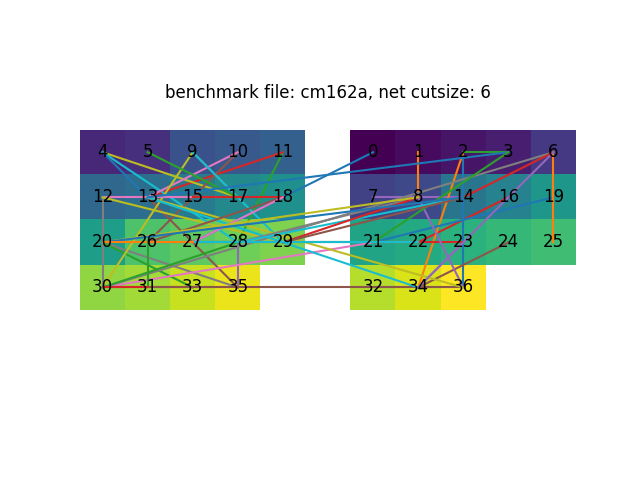

#  Routing

## 1 Lee-Moore and A* algorithms

([link](https://github.com/TAN-ZIXUAN/CPEN513/tree/main/routing))

example

# Placement

([link](https://github.com/TAN-ZIXUAN/CPEN513/tree/main/placement))

# Bi-partitioning Algorithms

## 1 Genetic Algorithm for Bi-partitioning

[(link)]([CPEN513/project at main · TAN-ZIXUAN/CPEN513 (github.com)](https://github.com/TAN-ZIXUAN/CPEN513/tree/main/project))

example

## 2 Branch and Bound Partitioning

([link](https://github.com/TAN-ZIXUAN/CPEN513/tree/main/bb_partition))

## 3 Kernighan-Lin Partitioning

([link](https://github.com/TAN-ZIXUAN/CPEN513/tree/main/partitioning))

