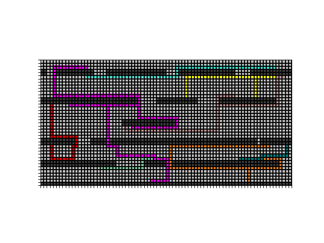
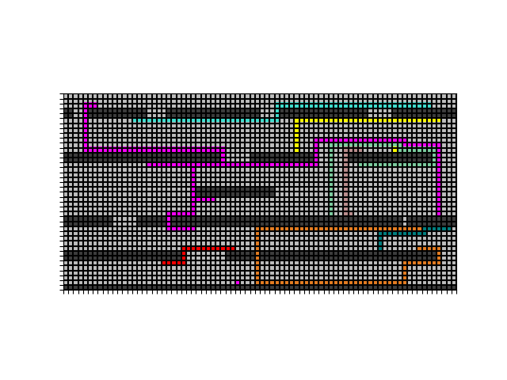

# Assignment 1 Routing

## Summary

In this assignment, I implement Lee-Moore and A* algorithms to connect one source to one or more sinks. Benchmark files are parsed and visualization of routing progress is generated by [`FuncAnimation`](https://matplotlib.org/api/_as_gen/matplotlib.animation.FuncAnimation.html). For wires with only one sink, A* algorithm is used to connect the source directly to its sink. For wire with more than one sink, Lee-Moore is used. It allows source to explore and connect source to the sink it reaches first. After finding the first sink and constructing the path,  it routes backwards from the sink and connect the sink to the previously constructed path. To solve routing problems for more difficult benchmarks, The algorithm routes the wires in different order.

([GitHub repository](https://github.com/TAN-ZIXUAN/CPEN513))

## Algorithms

#### Lee-Moore and A*

We parse the benchmark file first, creating structures to store the information. 

Lee-Moore (or Dijkstra)  and A* are algorithms for finding shortest path between nodes in a graph. Here we implement them on a 2d grid, routing sources and sinks.  The main differences between the two algorithms are their cost functions. The cost function of Lee Moore only uses the cell’s distance to the start cell, while A* also calculates the estimated distance from the current cell to the target. A* algorithms searches neighbour cells towards the direction of the target and Lee-Moore algorithm just explores the surroundings equally. Thus A* is often faster than Lee-Moore. 

In the programme, we route one source first, letting it explore the grid and connect the sink which it hits first. In this way, we form our first path. As the rest of the sinks can be connected to either the source or the constructed paths, we route from sinks and let it explore the grid for source  or paths. When routing wires with just only one source and one sink, we use A* algorithm. For the exploring part, we use Lee-Moore algorithm as we do not have a specific target.

Here is the pseudocode for the routing algorithm. 

```python
function routing(): // Return the amount of segment and wire we routed successfully
    routed_wire_count = 0
    routed_segment = 0
    for each wire in the wire list:
        if the number of sinks == 1:
            if A*(source, sink):	// route the source to the sink with A*
                routed_segment += 1
       	else:
            if Lee-Moore(source):	// else route the source to the first sink it hits
                routed_segment += 1
            for sink in the sinks list:	 // route from the rest of the sinks
                if the sink is already routed:
                    continnue	// skip it if the sink is already routed
                if Lee-Moore(sink):	// explore from the sink. connect it to source or the constructed path
                    routed_segment += 1
      	if all the pins of the wire are routed:
            routed_net_count += 1
     return routed_net_count
    
```

```python
function Lee-Moore(start): // return True: routed False: failed
    label the start with 1
    create a priority queue Q
    Q.put((label, start))
    curr_cell = None
    while Q is not empty:
        curr_cell <- Q
        if curr_cell is sink:
            break
        for each neighbour nei in curr_cell:
            if neighbour is unlabelled:
                label the neighbour with label of curr_cell  + 1
                Q.put((label, neighbour))
                record the predecessor of neighbour as curr_cell
   	else: // exist the while loop without hitting the target
        fail
    
    //Traceback： start at the target and walk back based on the predecessor.
    while True:
        if curr_cell is start: 
            break
        curr_cell = the predecessor of curr_cell
```

```python
function A*(start, target): // return True: routed False: failed
    label the start with 0 // as its distance to start is 0
    create a priority queue Q
    Q.put((label, start))
    curr_cell = None
    while Q is not empty:
        curr_cell <- Q
        if curr_cell is targt:
            break
        for each neighbour nei in curr_cell:
            if neighbour is unlabelled:
                distance_from_start = label of curr_cell  + 1
                cost = distance_from_start +  estimate_distance_to_target
                // we use manhattan distance as the estimate distance
                label the neighbour with cost 
                Q.put((label, neighbour))
                record the predecessor of neighbour as curr_cell
   	else: // exist the while loop without hitting the target
        fail
    
    //Traceback： start at the target and walk back based on the predecessor.
    while True:
        if curr_cell is start: 
            break
        curr_cell = the predecessor of curr_cell
```


#### Routing Order

Routing orders may effect the routing results. Both Lee-Moore and A* are shortest path algorithms. Some wires might block others’ paths. So routing order matters. We have tried different solutions for this problem.

- Basic routing: 

  Routing based on the number of pins and distance. Route wire with fewer pins first and sink closest to source first. (pseudocode see the above `function routing`)

- Routing with Shuffle:

  Route wire and pins in random order. Shuffle the wire list and sink list every time we start a routing

  

  ```python
  function route_with_shuffle(trail_time): # trial_time: the number of times we shuffle and reroute the grid
      routed_wire_count = 0
      max_routed_wire_count = 0
      routed_segment = 0
      max_routed_segment = 0
      i = 0
      while i < trial_time and routed_wire_count < total_wire_number:
          routed_wire_count = 0
      	routed_segment = 0
          shuffle wire list
          for each wire in the wire list:
              if the number of sinks == 1:
                  if A*(source, sink):	// route the source to the sink with A*
                      routed_segment += 1
              else:
                  shuffle sink list
                  if Lee-Moore(source):	// else route the source to the first sink it hits
                      routed_segment += 1
                  for sink in the sinks list:	 // route from the rest of the sinks
                      if the sink is already routed:
                          continnue	// skip it if the sink is already routed
                      if Lee-Moore(sink):	// explore from the sink. connect it to source or the constructed path
                          routed_segment += 1
              if all the pins of the wire are routed:
                  routed_net_count += 1
              max_routed_net_count = max(max_routed_net_count, routed_net_count)
           max_routed_segment = max(max_routed_segment, routed_segment)
      return max_routed_segment
  ```

  

  

## GUI

We use the  [`FuncAnimation`](https://matplotlib.org/api/_as_gen/matplotlib.animation.FuncAnimation.html) to visualize the routing process. It takes the grid consists of colour and draw the colour grid on each frame as the colour grid is updated by the routing algorithm. Generator is used for customized frame here. To visualizing the routing process, we put `yield` where we need a frame.  

After this, we use its save function to save the animation as a gif file.

### Test

We use `pytest` as the testing frame work for our algorithm. We test the routing algorithms with the provided benchmark files. The return value of the routing algorithm is the number of wire routed successfully. We pass different benchmark files to the routing algorithm and assert if the number routed wire equals to the total number of wires in the grid or the max number of wires can be routed.

To test the routing function with different benchmark files, `parametrize` from `pytest` is used. We create a test_input, a list of benchmark file  and a list of expected output.

#### Routing based on the number of pins and distance

Here is an example of code used to test the route function which routes based on the number of wires and the sink’s distance to source.

(*Here for impossible benchmark files, the expected output is the max amount of segments that can be routed rather than the total number of  segment. So the routing algorithm should be able to pass the tests for the two impossible benchmark files)

```python
file_name = ["example.infile", "impossible.infile", "impossible2.infile", "kuma.infile", "misty.infile", "oswald.infile", "rusty.infile", "stanley.infile", "stdcell.infile", "sydney.infile"]
expected = [3, 3, 3, 6, 5, 1, 4, 5, 18 ,3]

# wrap the routing function so we can test it with different benchmark files
def route_all_at_file(file_path):
    load_file(file_path)
    return route_all()

# create test_input used for parametrize testing
test = []
for i in range(len(file_name)):
    test.append(("benchmarks/" + file_name[i], expected[i]))
# print(test)

@pytest.mark.parametrize("test_input, expected", test)
def test_route_all(test_input, expected):
  assert route_all_at_file(test_input) == expected
```

The test results are: 5 failed, 7 passed. This routing algorithm couldn’t solve the `kuma`,` misty`, `oswald`, `temp`and `stdcell` benchmark files.

```
FAILED n_route.py::test_route_all[benchmarks/kuma.infile-6] - AssertionError: assert 5 == 6
FAILED n_route.py::test_route_all[benchmarks/misty.infile-5] - AssertionError: assert 4 == 5
FAILED n_route.py::test_route_all[benchmarks/oswald.infile-2] - AssertionError: assert 1 == 2
FAILED n_route.py::test_route_all[benchmarks/stdcell.infile-18] - AssertionError: assert 17 == 18
FAILED n_route.py::test_route_all[benchmarks/temp.infile-17] - AssertionError: assert 15 == 17
```

#### Routing with shuffle

Then we use the routing algorithm with shuffle. The test result only has  3 failures. It couldn’t route `kuma`,  `tmp`and `oswald` correctly. 

```python
FAILED n_route.py::test_route_with_shuffle[benchmarks/kuma.infile-6] - AssertionError: assert 5 == 6
FAILED n_route.py::test_route_with_shuffle[benchmarks/oswald.infile-2] - AssertionError: assert 1 == 2
FAILED n_route.py::test_route_with_shuffle[benchmarks/temp.infile-17] - AssertionError: assert 15 == 17
```


## Result

(*Here for impossible benchmark files, the expected output is the max amount of segments that can be routed rather than the total number of segments. So the routing algorithm should be able to pass the tests for the two impossible benchmark files)

|  benchmark file  | routed segments | max amount of segments can be routed | Total number of segments |
| :--------------: | :-------------: | :----------------------------------: | :----------------------: |
|     example      |        3        |                  3                   |            3             |
|    impossible    |        3        |                  3                   |            5             |
|   impossible2    |        3        |                  3                   |            6             |
|  *kuma (failed)  |        5        |                  6                   |            6             |
|      misty       |        5        |                  5                   |            5             |
| *oswald (failed) |        1        |                  2                   |            2             |
|      rusty       |        4        |                  4                   |            4             |
|     stanley      |        5        |                  5                   |            5             |
|     stdcell      |       17        |                  18                  |            18            |
|      sydney      |        3        |                  3                   |            3             |
|  *temp(failed)   |       15        |                  17                  |            17            |
|       wavy       |        7        |                  7                   |            7             |


The routed image results shown as below. (The gif animations are on [GitHub](https://github.com/TAN-ZIXUAN/CPEN513)))

1. example

2. impossible

3. impossible2

4. kuma

5. misty

6. oswald

7. rusty

8. stanley

9. stdcell

10. sydney

11. temp

12. wavy

    